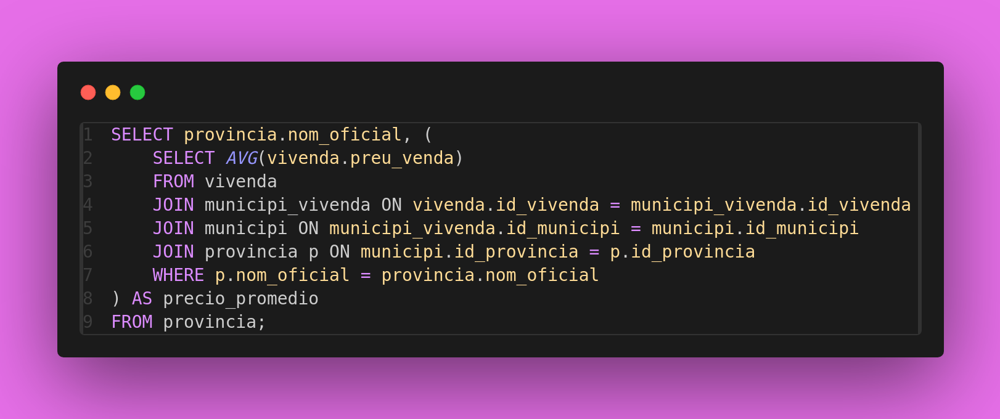
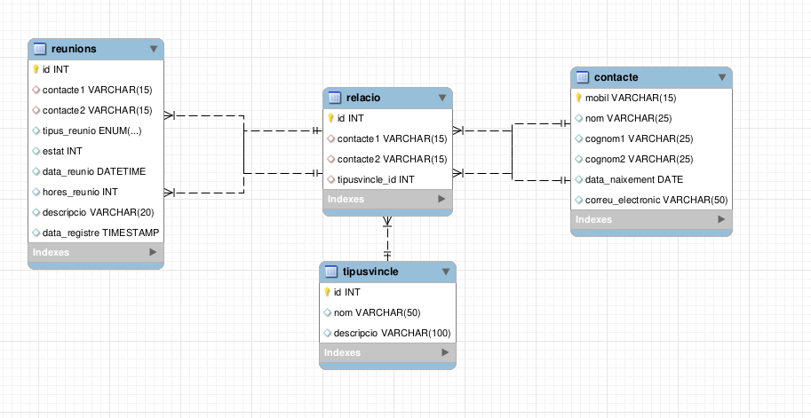

# BBDD_SQL

Welcome to the BBDD_SQL repository!

This repository contains materials related to the Databases subject, focusing on SQL (Structured Query Language).

## Contents

1. **SQL Scripts**: Contains SQL scripts for creating and manipulating databases, tables, and data.
2. **Documentation**: Includes documentation files such as ER diagrams, database schemas, and usage guidelines.
3. **Sample Data**: Provides sample datasets for practicing SQL queries and testing database operations.

## SQL Topics Covered

- Database Design
- Data Manipulation
- Data Definition
- Joins and Subqueries
- Indexes and Constraints
- Transactions and Locks
- Views and Stored Procedures
- Performance Optimization

## Usage

1. Clone the repository to your local machine:

git clone https://github.com/laasso/BBDD_SQL.git

2. Explore the folders and files to access SQL scripts, documentation, and sample data.
3. Use an SQL client or command-line interface to execute the SQL scripts against your database system for learning and practicing SQL.

## Resources

- [Operatiu Cat](http://operatiu.cat/): Online Databses for practice and notes.
- [SQL Tutorial](https://www.w3schools.com/sql/): W3Schools SQL tutorial for beginners.
- [SQLZoo](https://sqlzoo.net/): Interactive SQL tutorial with exercises.
- [SQL Fiddle](http://sqlfiddle.com/): Online SQL sandbox for testing queries.

## Screenshots

*Screenshot 1: Example of a SQL query*

*Screenshot 2: Reverse Engineer of a sample database*

## Contributions

Contributions to improve the content, add more SQL examples, or fix issues are welcome. Feel free to fork this repository and submit pull requests.

## License

This project is licensed under the MIT License - see the [LICENSE](repoInfo/license) file for details.

